# Rock, Paper, Scissors, Lizard, Spock (RPSLS) Website

Welcome to the Rock, Paper, Scissors, Lizard, Spock (RPSLS) game! This web-based game is a twist on the classic "Rock, Paper, Scissors" game adding two more choices - Lizard and Spock - based on the famous TV show, The Big Bang Theory.

How to play:

1. Choose how many rounds you would like to play. Your options are: 
  * 3 rounds
  * 5 rounds
  * 7 rounds
2. Choose your move: Rock, Paper, Scissors, Lizard or Spock.
3. The computer will make a choice the same time as you.
4. After the end of the game the winner will be displayed based on the rules provided at the bottom of the page.

I hope you will enjoy playing RPSLS as much as I enjoyed creating it!

Happy gaming!

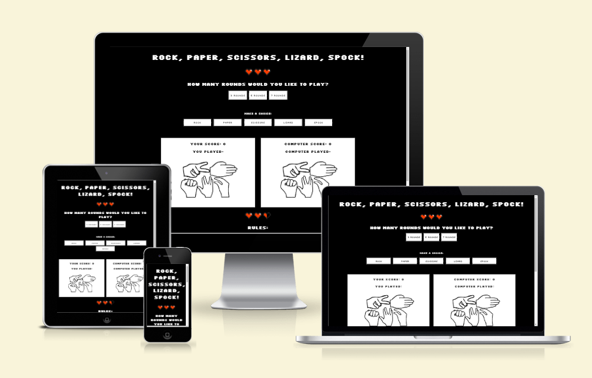

[View RPSLS on Github pages](https://github.com/Keszi94/rock-paper-scissors-lizard-spock)

- - -

## CONTENTS
 
 * [Design](#design)
   * [Colour Scheme](#colour-scheme)
   * [Typography](#typography)
   * [Imagery](#imagery)
   * [Wireframes](#wireframes)

   * [Features](#features)
   * [Accessibility](#accessibility)

* [Technologies Used](#technologies-used)
   * [Languages Used](#languages-used)
   * [Frameworks, Libraries & Programs Used](#frameworks-libraries--programs-used)

* [Deployment & Local Development](#deployment--local-development)
   * [Deployment](#deployment)
   * [Local Development](#local-development)
   * [How to Fork](#how-to-fork)
    * [How to Clone](#how-to-clone)

* [Testing](#testing)

* [Credits](#credits)
   * [Code Used](#code-used)
   * [Content](#content)
   * [Media](#media)
   * [Acknowledgments](#acknowledgments)

---

## Design 

### Color Scheme

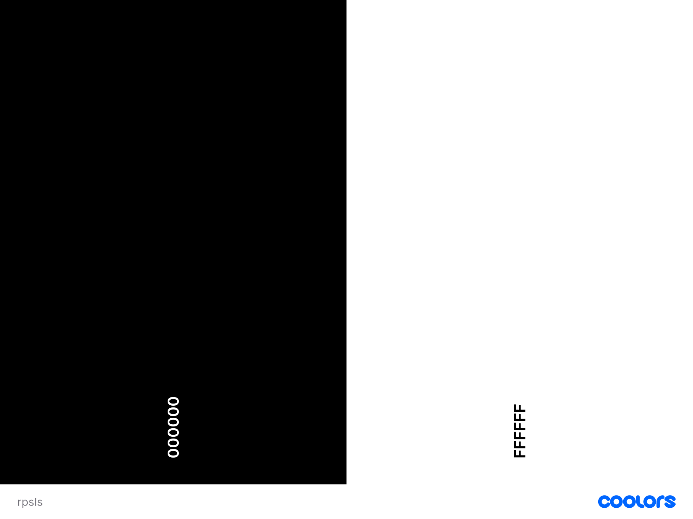

The website uses only two colors, black and white. The look of the website was inspired by 8bit games such as Underale and Deltarune. I have added a splash of color by using two small png images with red hearts in the body of the webpage.

The colour palette was created using the [Coolors](https://coolors.co/) website.

### Typography 

Google Fonts was used for the following font: 

* Silkscreen is used for all the text on the site. It is a sans serif font.
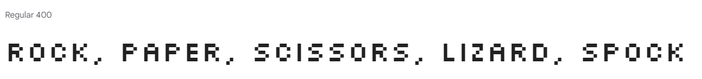
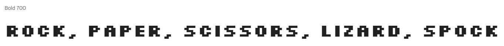

### Imagery 

All featured photos were taken from various free stock photo websites. I have credited these in the [credits](#Credits) section.

### Wireframe

A wireframe was created for mobile, tablet and desktop.

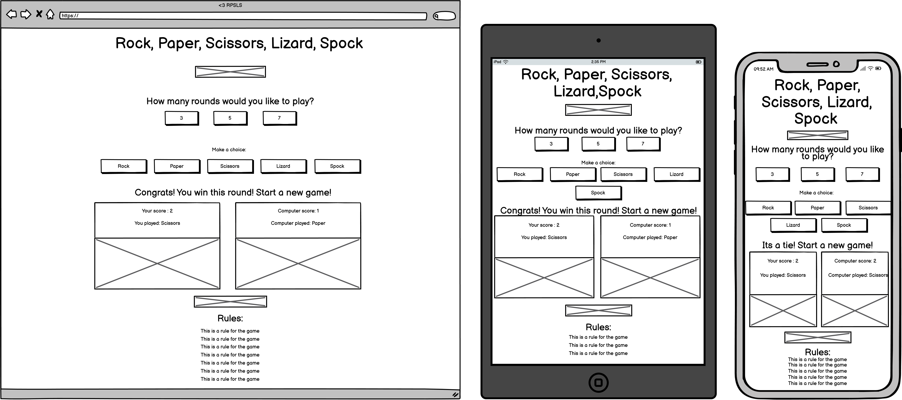

### Features

The website is one page which is comprised of:

* A header with simple text stating the name of the website/game with a simple image underneath to break up the page.

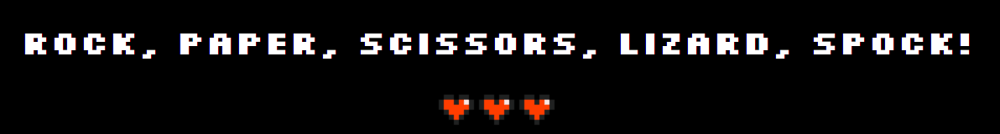

* at the top of the main area there are three buttons that gives the player the choice of how many rounds they would like to play. The buttons change color when clicked and then go back to their default style when an other button is clicked.

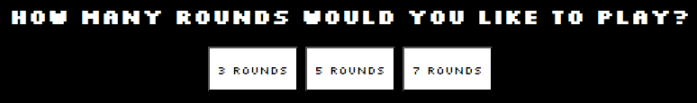
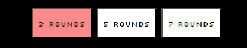

* In the main game area there are five buttons with the possible choices of hands to play.

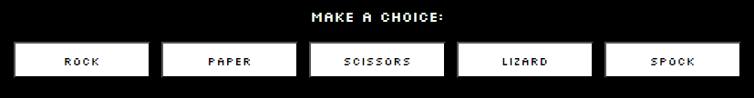

* Also in the game area there is the message displaying the winner of each round and also the final winner of the game, two seperate sections for the player and the computer which have a score and a hand played display as well as images that change depending on the choices made.

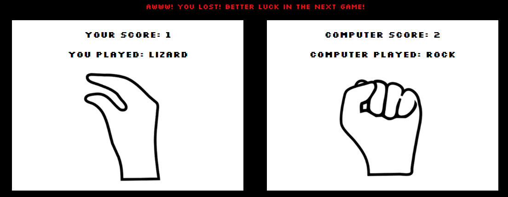
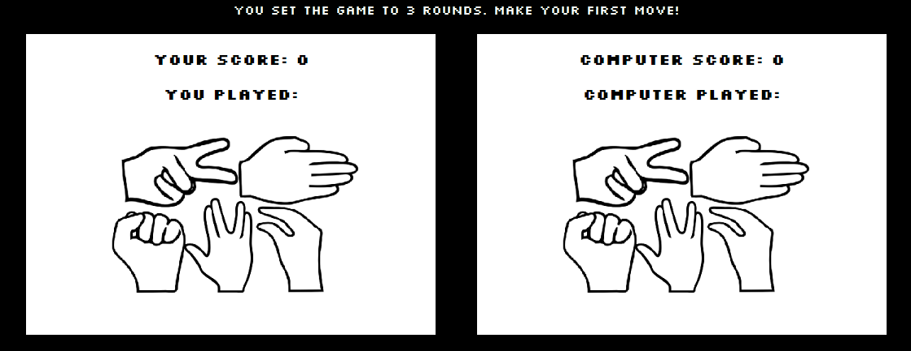

* In the footer element you can find the rules section.

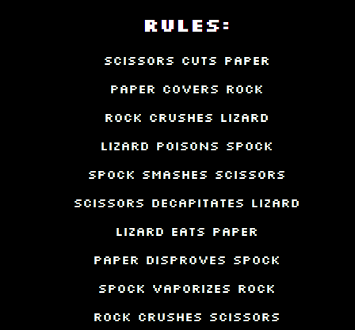

### Accessibility

I have been mindful during coding to ensure that the website is as accessible friendly as possible. I have achieved this by:

* Using semantic HTML.
* Using descriptive alt attributes on images on the site.
* Ensuring that there is a sufficient colour contrast throughout the site.
* Choosing a sans serif font for the site - these fonts are suitable for people with dyslexia.

- - - 

## Technologies Used

### Languages Used

HTML, CSS and JavaScript

### Frameworks, Libraries & Programs Used

Balsamiq - Used to create wireframes.

Github - To save and store the files for the website.

Google Fonts - To import the fonts used on the website.

[ImageResizer.com](https://imageresizer.com/resize/download/66b0eeb175dd25c968ff86c6) To resize images.

[Am I Responsive?](http://ami.responsivedesign.is/) To show the website image on a range of devices.

[Favicon.io](https://favicon.io/) To create the favicon.

[Google Developer Tools](https://developer.chrome.com/docs/) To troubleshoot and test features, test the websites loading speed with the Lighthouse feature.

- - -

## Deployment & Local Development

### Deployment

Github Pages was used to deploy the live website. The instructions to achieve this are below:

1. Log in (or sign up) to Github.
2. Find the repository for this project, [Keszi94/rock-paper-scissors-lizard-spock](https://github.com/Keszi94/rock-paper-scissors-lizard-spock).
3. Click on the Settings link.
4. Click on the Pages link in the left hand side navigation bar.
5. In the Source section, choose main from the drop down select branch menu. Select Root from the drop down select folder menu.
6. Click Save. Your live Github Pages site is now deployed at the URL shown.

### Local Development

#### How to Fork

To fork the rock-paper-scissors-lizard-spock repository:

1. Log in (or sign up) to Github.
2. Go to the repository for this project, [Keszi94/rock-paper-scissors-lizard-spock](https://github.com/Keszi94/rock-paper-scissors-lizard-spock).
3. Click the Fork button in the top right corner.

#### How to Clone

To clone the rock-paper-scissors-lizard-spock repository:

1. Log in (or sign up) to GitHub.
2. Go to the repository for this project, [Keszi94/rock-paper-scissors-lizard-spock](https://github.com/Keszi94/rock-paper-scissors-lizard-spock).
3. Click on the code button, select whether you would like to clone with HTTPS, SSH or GitHub CLI and copy the link shown.
4. Open the terminal in your code editor and change the current working directory to the location you want to use for the cloned directory.
5. Type 'git clone' into the terminal and then paste the link you copied in step 3. Press enter.

- - -

## Testing

Testing was ongoing throughout the entire build. I utilised Chrome developer tools while building to pinpoint and troubleshoot any issues as I went along.

### W3C Validator

The W3C validator was used to validate the HTML on the website. It was also used to validate CSS in the style.css file.

#### Index page

* [Index.html HTML](assets/images/readme-images/markup-validation-html.png)
* [style.css CSS](assets/images/readme-images/validation-css.png)

#### 404 Error Page

* [error page validation](assets/images/readme-images/error-pg-markup-valid.png)

### WAVE Testing

#### Index page

During testing Wave gave me the following alert: "No page regions"

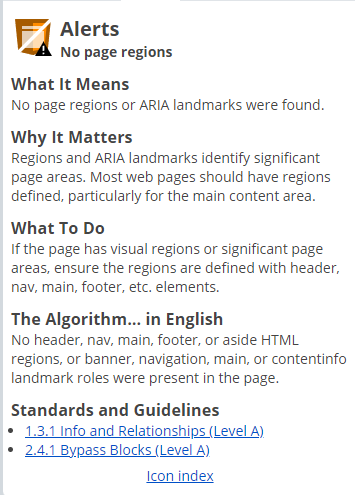
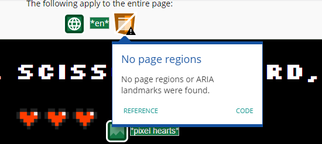

I have fixed the issue by including a Header, a body and a footer element in my HTML code. After including those in my code the test returned no further alerts.

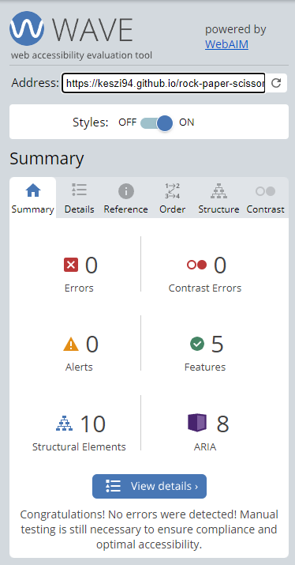

#### 404 Error Page 

No alerts were given when testing 404.html.

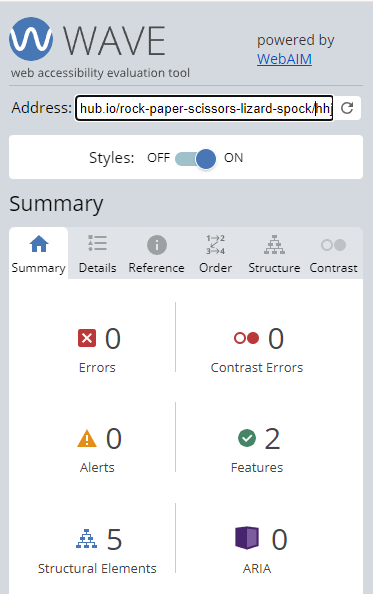

### Manual Testing

To ensure a smooth and reliable user experience I have tested the RPSLS website on various devices and browsers. My testing covered various possible scenarios to ensure compability and good performance across different platforms.

Below are the details of my testing process:

#### Devices tested

1. Samsung Galaxy S21 FE
  * The game runs without any complications with responsive touch control and no visual or performance issues.

2. OnePlus Nord 
  * Same as on the other device, the game performs well, the gameplay is responsive.

#### Browsers tested on Desktop

1. Google Chrome
  * The game loads quickly with all interactions functioning as expected. No issues found at final testing.

2. Opera
  * The game operates seamlessly, the performance is consistent and the features are fully functional. No issues detected.

3. Mozilla Firefox
  * The game loads without any issues, the gameplay is responsive, no bugs present. There is a slight difference in how the message displays on the page - the message 'touches' the top of the player boxes unlike in the other browsers where there is space around the message display.

#### Full manual testing

* Index Page

| Feature | Expected Outcome | Testing Performed | Result | Pass/Fail |
| --- | --- | --- | --- | --- |
| 3 Rounds button | Should set the game to be played only for 3 rounds, the button's background should turn red when clicked | Clicked on button | Game is set to 3 rounds max, button's background turned red | Pass |
| 5 Rounds button | Should set the game to be played only for 5 rounds, the button's background should turn red when clicked | Clicked on button | Game is set to 5 rounds max, button's background turned red | Pass |
| 7 Rounds button | Should set the game to be played only for 7 rounds, the button's background should turn red when clicked | Clicked on button | Game is set to 7 rounds max, button's background turned red | Pass |
| 'Rock' button | Should set the player's choice to be 'Rock', 'computer' should display a random choice | Clicked on button | Player's choice is set to 'Rock' and computer displays random hand | Pass |
| 'Paper' button | Should set the player's choice to be 'Paper', 'computer' should display a random choice | Clicked on button | Player's choice is set to 'Paper' and computer displays random hand  | Pass |
| 'Scissors' button | Should set the player's choice to be 'Scissors', 'computer' should display a random choice | Clicked on button | Player's choice is set to 'Scissors' and computer displays random hand  | Pass |
| 'Lizard' button | Should set the player's choice to be 'Lizard', 'computer' should display a random choice | Clicked on button | Player's is set to 'Lizard' and computer displays random hand | Pass |
| 'Spock' button | Should set the player's choice to be 'Spock', 'computer' should display a random choice | Clicked on button | Player's choice is set to 'Spock' and computer displays random hand | Pass |
| Message area - after any 'rounds' button is pressed | message should display: "You set the game to 3/5/7 rounds. Make your first move!" in white text color | clicked on 3/5/7 rounds button | The correct message displays each time in white | Pass |
| Message area - after each round played | The message should display who won/lost the current round or if it was a tie in white text color | pressed either button to choose player hand | The correct message displays each time in white | Pass |
| Message area - when the player wins the game | The message "Congrats! You are the winner! Start a new game!" should display with green text color | the player wins the game | Intended messages displays in green | Pass |
| Message area - when the player loses the game | The message "Awww! You lost! Better luck in the next game!" should display with red text color | the player loses the game | Intended messages displays in red | Pass |
| Message area - when the game is a tie the game | The message "It's a tie! Start a new game!" should display with orange text color | the game end in a tie | Intended messages displays in orange | Pass |
| Score counter - player | The score counter should begin at 0. Each time player wins the score should increase by 1. If player loses the round the score should remain the same | played game until player won and lost | When player won the score increased by 1, when player lost the score stayed the same | Pass |
| Score counter - computer | The score counter should begin at 0. Each time computer wins the score should increase by 1. If computer loses the round the score should remain the same | played game until computer won and lost | When computer won the score increased by 1, when computer lost the score stayed the same | Pass |
| You played - choice text displayed for player | After the player makes their choice it should print the hand chosen by the player | clicked on all choice buttons | player choice printed each of my choices correctly ex. clicked: 'Rock' => player choice: Rock | Pass |
| Computer played - choice text displayed for computer | After the player makes their choice it should print the hand chosen by computer | clicked on all choice buttons | computer choice printed choices correctly - I have used console log to check | Pass |
| Player and computer hand image - default | A specific image should display when the page is first loaded and when the game is reset | Restarted the game by clicking a rounds button | The default image displayed | Pass |
| Player hand image | An image of the hand chosen should display in the player area after the choice button is clicked | Clicked all of the choice buttons | After clicking all the available choices the correct images showed in the player area each time | Pass |
| Computer hand image | An image of the random hand chosen should display in the computer area after the choice button is clicked by the player | Clicked all of the choice buttons | After clicking all the available choices the correct images showed in the computer area each time - I have used console log to check | Pass |

* 404 Error Page

| Feature | Expected Outcome | Testing Performed | Result | Pass/Fail |
| --- | --- | --- | --- | --- |
| Home button | Should take the visitor back to the Index page | Clicked on Home button | I got redirected to the index page. | Pass |

### Lighthouse Testing

I used Lighthouse within the Chrome Developer Tools to test the performance, accessibility, best practices and SEO of the website.

#### Mobile Testing:

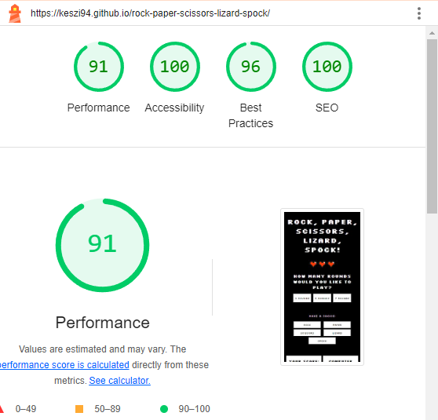

#### Desktop Testing:

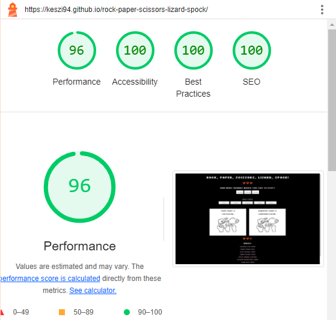

### JavaScript Validator

[jshint](https://jshint.com/) was used to test the JavaScript code.

[script.js](assets/images/readme-images/jshint.png) - Passed with two warnings, both the same: "Functions declared within loops referencing an outer scoped variable may lead to confusing semantics."

### Solved Bugs

1. During manual testing I have noticed that when playing a 3 round game the message displaying the winner would print the 'tie' message even if the scores were 2 to 1. This was caused by calling declareWinner before updateScores in the runGame function. I have fixed the issue by swapping them. 

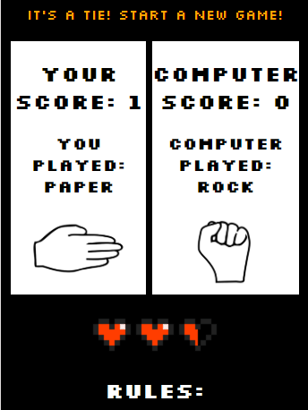

2. After creating the function that changed the meassage's text color depending on the games outcome the text color would stay the same after resetting the game. I have fixed this by removing the css classes from the message in the round button's event listener.

3. When adding the function getHandPlayed to display which button the player and the computer chose for the current round, the playerHand would not display. It was caused by a typo in declaring the constant for playerHand. I corrected it and the function worked without any issues after.

4.  During manual testing I have noticed that the checkWinner function did not work. This was due to the incorrect use of the 'or' (||) operator. After searching on google for a solution I was able to find a relevant question on the [stackoverflow](https://stackoverflow.com/) forum, which helped me with the correct usage of the operator.

5. After calling the resetGame function the images displayed inside the game area would not go back to the original image. I have fixed this by calling the images from inside the function, therefore whenever the function executes now it calls on the images by using the source provided inside the function.

6.  After adding the option to choose how many rounds the player would like to play the game logic started working backwards, declaring that rock beat paper and paper beat rock, etc. My mentor, Graeme Taylor pointed it out to me  that inside the runGame function and in the getHandPlayed function call the arguments were written in the wrong order. Switching them solved the issue.

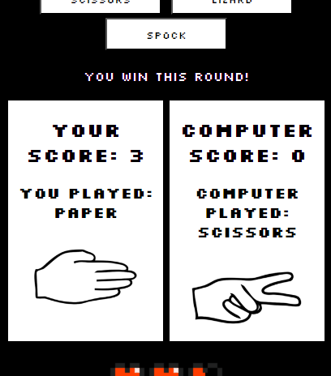

- - - 

## Credits

### Code Used

* I was inspired by [this Youtube tutorial](https://www.youtube.com/watch?v=3uKdQx-SZ5A&t=9s) - to make the winner messages display with a different color depending on the game's outcome.
* Used the exaamples on [this](https://www.codewizardshq.com/javascript-tutorial-for-kids-rock-paper-scissors/) - website to help me create a basic structure for some of my functions.

I have used the following websites to gather relevant information during my research:
* [Stackoverflow](https://stackoverflow.com/)
* [Reddit](https://www.reddit.com/)
* [Thecodingforums](https://www.thecodingforums.com/)
* [W3Schools](https://www.w3schools.com/)

### Content

* I took the complete list of rules from the [Big Bang Theory Wiki](https://bigbangtheory.fandom.com/wiki/Rock,_Paper,_Scissors,_Lizard,_Spock) website.
* I created my Readme file based on [Kera Cudmore's](https://github.com/kera-cudmore) [Bully Book Club](https://github.com/kera-cudmore/Bully-Book-Club) and [TheQuizArms](https://github.com/kera-cudmore/TheQuizArms) Readme file.

### Media

#### Images

* The 'hand' images used in the game-area and the 'heart' images, including the favicon were taken from the website [pngwing.com](https://www.pngwing.com/) and then cropped using windows paint.

### Acknowledgments

I would like to acknowledge the following people who helped me along the way in completing my first milestone project:

* [Graeme Taylor](https://github.com/G-Taylor), my Code Institute Mentor.